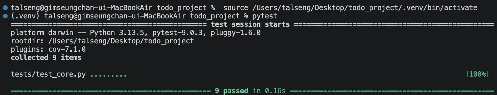
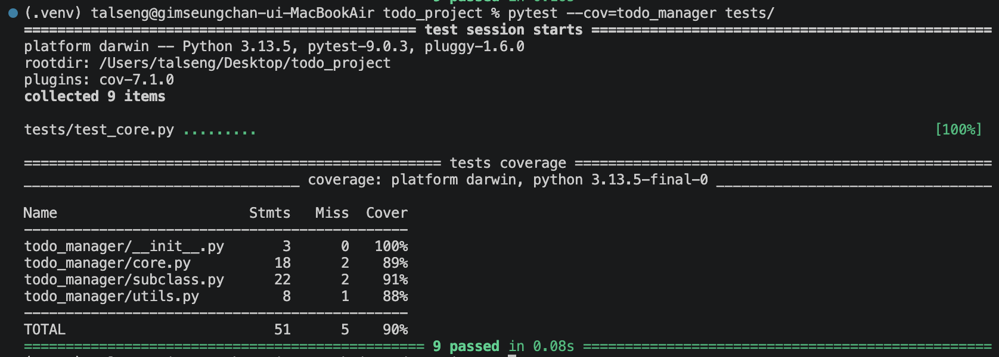

# Todo Manager (할 일 관리 도구)

## 1. 프로젝트 개요
`todo_manager`는 Python 객체지향 프로그래밍(OOP)을 활용하여 할 일을 생성하고, 완료 처리하며, 반복되는 할 일(Recurring Task)을 관리할 수 있는 패키지입니다.

## 2. 설치 방법
로컬 환경에서 가상환경을 켠 상태로 아래 명령어를 통해 패키지를 설치할 수 있습니다.
`pip install .`

## 3. 빠른 시작 (Quick Start)
```python
from todo_manager.core import Task
from todo_manager.subclass import RecurringTask

# 일반 할 일 생성 및 완료
task = Task("파이썬 기말 과제", "2026-06-10")
task.complete()
print(task.get_summary())

# 반복 할 일 생성 및 완료
rtask = RecurringTask("매일 알고리즘 풀기", recurrence_rule="daily")
rtask.complete()
print(rtask.get_summary())
```

## 4. 주요 기능 설명
* 일반 할 일 관리 (Task): 제목과 마감 기한을 설정하고 완료 상태를 추적합니다.
* 반복 할 일 관리 (RecurringTask): Task를 상속받아 반복 주기(daily, weekly, monthly)를 설정하고 누적 완료 횟수를 기록합니다.
* 유효성 검사: 제목이 비어있거나 규칙이 잘못된 경우 오류를 발생시켜 데이터를 보호합니다.
* 데이터 저장: 작성된 할 일 목록을 JSON 파일 형식으로 저장 및 내보내기 지원합니다.

## 5. 테스트 방법
루트 디렉터리에서 아래 명령어를 실행하여 단위 테스트를 진행할 수 있습니다.
`pytest`

## 6. 작성자 정보
* 이름: 김승찬
* 소속: 건국대학교 글로컬캠퍼스 컴퓨터공학과

## 7. 실행 결과

### 7.1 코드 스타일(pycodestyle) 검사 결과
경고 없음(0건)


### 7.2 단위 테스트(pytest) 실행 결과


### 7.3 테스트 커버리지 (pytest-cov) 결과
모든 핵심 로직에 대해 100%에 준하는 테스트 커버리지를 달성.
